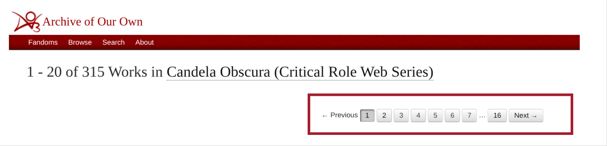

# IMT 542 Final Project: Ao3 Metadata Mapper
#### Em Stelter, SPR 2026

## Project Context
This is a student-led information architecture project developed for the UW Master of Information Management program. The primary project goal was to "build a prototype product that strives for a transcendent goal of improving the community or society by making existing information more portable."
I chose to create **Ao3 Metadata Mapper**, a tool that scrapes, organizes, analyzes, and visualizes fanwork metadata from archiveofourown.org, or Ao3. In essence, Ao3MM a prototype digital humanities support tool that helps users analyze trends in the collective fanworks of any fandom with a presence on Ao3.

### About Fanworks, Ao3, and Fandom Meta Analysis

For folks who are not as familiar with fanfiction or online fan communities:

**Fanworks** are (broadly) works of writing, visual art, music, and critical analysis (among other forms of expression) made by fans using or examining the source material of an existing story. Fan communities come together over a shared love of or interest in a common IP, story, source material, etc. Fanworks are made to celebrate, analyze, critique, iterate upon, and generally be in conversation with that source material and with each other.

**archiveofourown.org, or Ao3,** is the preeminent digital repository for fanfiction and other transformative fanworks, run by the Organization for Transformative Works. The OTW's mission statement reads, "The Organization for Transformative Works (OTW) is a nonprofit organization, established by fans in 2007, to serve the interests of fans by providing access to and preserving the history of fanworks and fan culture in its myriad forms. We believe that fanworks are transformative and that transformative works are legitimate" (OTW, 2026).
Information access and data preservation are fundamentally baked into Ao3’s mission from its founding as one of the OTW’s main projects.

You may have encountered or heard of fanfiction, fanart, fan videos, etc., but one sometimes overlooked type of transformative work is **fandom meta analysis**. Fandom meta analysis involves studying and analyzing one's fan community's fanworks, to answer the question, "What does my community's collective fanworks say about our relationship to our fandom's source material?" For instance, if the *Game of Thrones* fandom is full of a bunch of fluffy alternate universe romance fanfics, that says something interesting about the *Game of Thrones* fandom, and fans’ relationship to a notoriously dark and gritty story.
Fandom meta analysis in general might involve written or video essays, podcasts, etc., as well as data analysis and visualization. (Example: “[Fandom stats] Biggest fandoms, ships, and characters on AO3: Looking back at 2024” (toastystats, 2025, https://archiveofourown.org/works/62863873).) 

### Why Ao3MM?
Archive of Our Own metadata is a rich source of information to support fandom meta analysis. However, there are currently (as of June 2026) no official or unofficial tools for exporting and analyzing Ao3 fanwork metadata in bulk. There is an unofficial command line tool for bulk-downloading whole fanworks from Ao3 called ao3downloader, developed by Github user nianeyna. (Archive of Our Own allows users to download fanworks in ereader formats; ao3downloader is a python script that can download fics in bulk. I have used ao3downloader extensively; however, bulk downloading whole fanworks can take a substantial amount of time.) 

Ao3MM helps address this gap. The goal of Ao3MM is to support fan community members who love to do fandom meta analysis, and to provide some scaffolding to fans without a robust technical background who want to include Ao3 data visualization in their work.

---

## How Ao3MM Works (Methodology)
Ao3 Metadata Mapper organizes fanwork metadata in a JSON array. Ao3MM generates the JSON array in the following steps:
1) First, it takes in the first webpage of an Ao3 fandom (example: https://archiveofourown.org/tags/Candela%20Obscura%20(Critical%20Role%20Web%20Series)/works) and scrapes the page for a list of “pagination links” (box circled in red below). The combined pagination links contain links to all the fanworks for the given Ao3 fandom, but each pagination link only displays 20 fanworks. I have not yet found a reliable way in Ao3’s UI to display all fanwork links on a single page, so it’s necessary to scrape for a list of individual pagination links.

2) Second, for each pagination link, Ao3MM scrapes the webpage for a list of links to the 20 fanworks on that page.
3) Third, for each fanwork link, Ao3MM scrapes the page for the desired metadata, then organizes the metadata into a dictionary. Ao3MM then compiles the individual fanwork dictionaries into a nested dictionary.
4) Fourth, Ao3MM converts the nested dictionary of all fanwork metadata into a JSON array and saves the JSON file to local storage for safekeeping.
5) Last, Ao3MM loads the saved JSON file, converts it to a dataframe, and uses plotly.express to generate visualizations of the saved metadata.

**Python libraries used to accomplish the above steps (beyond native libraries):**

| Library         | Use description                                                                         |
|-----------------|-----------------------------------------------------------------------------------------|
| requests        | pulls html documents from pagination and fanwork links                                  |
| BeautifulSoup   | parses pulled html documents / creates soup objects for text parsing and simplification |
| RegEx           | supports text parsing and simplification of BeautifulSoup objects to extract metadata   |
| json            | converts nested fanwork dictionary to JSON array                                        |
| pandas          | used to create dataframe from JSON array and organize data for visualizations           |
| plotly.express  | creates interactive data visualizations based on standardized Ao3 metadata categories   |

For more info on how Ao3MM is intended to be used, see 'Ao3MM Methodology and Access.md'.

---

## Repo Contents
### assets
- visualizations: contains interactive plotly.express charts saved as .html files, plotted in visualizations.ipynb
- screenshots: contains .png screenshots used in documentation and troubleshooting

### data
Contains .txt, .json, and .csv files
- csv_files: contains csvs from dataframes cleaned & prepped in data_cleaning.ipynb
- json_files: contains json files from testing procedures
- test_html_files: contains whole page html documents (NOT BeautifulSoup objects) from early testing process
- txt_files: contains .txt files from testing procedures

### documentation_assignments
Contains project documentation artifacts, including:

- Updated Information Story PDF and .pptx files - describes project scope & early visualization wireframes
- 'Ao3 Metadata F.A.I.R Assessment.xlsx' - excel sheet scoring Archive of Our Own on FAIR criteria
- 'F.A.I.R. Assessment Summary.txt' - summarizes findings from FAIR Assessment scoring exercise
- 'Ao3MM Metadata Schema.md' - contains names, information types, and descriptions for Ao3MM metadata fields
- 'Ao3MM Methodology and Access' - describes how Ao3MM works (step-by-step) and how it is meant to be used by fellow fans
- 'Ao3MM Test Plan.md' - Contains functional and performance test recommendations (and future scope for implementing / expanding performance monitoring system)
- 'IMT 542 Final Presentation_Stelter.pptx' - final presentation slide deck
- 'info_structure_samples' - contains sample "before and after" files (.txt and .json respectively) as well as a file describing improvements to the existing information structure
- 'original_assignment_submissions' - contains original versions of Group/project assignment files for reference

### notebooks
Contains Jupyter notebooks used to define & test functions before drafting .py scripts:

### src
Contains .py scripts that define functions for each step of Ao3MM's process. Provides functions called in test_scripts.

### test_scripts
Contains test .py scripts that are ready-to-run aligned with functional tests described in 'Ao3MM Test Plan.md'.

---

## Project Limitations & Ethics
Insights drawn from data visualizations created with this tool should not be taken as universal truth about the nature of any particular fandom or its fan authors, as the dataset is pulled from one source of fanworks, Archive of Our Own. While Ao3 is one of the most prolific digital fanwork repositories, it is not the sole digital space where fanworks are created and shared. Additionally, Ao3 operates as a digital repository that does not censor or restrict the content of fanworks. As with all art, for myriad reasons, Ao3 authors may choose to explore uncomfortable, upsetting, or even offensive themes in their works. Insights drawn from this tool that reflect a fandom's collective exploration of objectionable ideas should not be taken as evidence of the character, values, or IRL behavior of fan authors. This tool is designed to support digital humanities meta-analysis for personal interest, entertainment, and study.

At this time, Ao3MM does not capture metadata from archive-locked fanworks--that is, fanworks that have been access-restricted by their authors and are only accessible to other Archive of Our Own account holders. Ao3 authors archive-lock their works for a number of reasons, such as preventing or discouraging scraping of their works for AI model training (as much as this is possible), or simply for personal privacy reasons.

In the original scope of this project I had planned to include Archive-locked fanworks in my web scraping, but due to capacity and time constraints I haven't yet developed this functionality.

In the future, I do hope to include metadata from archive-locked works for analysis and visualization. I believe it is important to include archive-locked metadata because in some cases, archive-locked fanworks can make up a significant proportion of an Ao3 fandom's works, and my goal is to provide interested fan digital analysts with a means to accurately visualize and better understand their fandom's collective works. I believe in preserving the full set of metadata to represent the truth of the fandom's collective art (as much as possible). 

To address this challenge in the future, and to protect the privacy of all Ao3 users now, I've chosen to exclude unique identifiers for each fanwork in my dataset. This means that any users looking at the raw data in my data structure will not be able to pick out individual fanworks from the dataset and match them to certain metadata. The goal here is to minimize harm to authors who have explicitly chosen to keep their works private from users without an Ao3 account. Theoretically a dedicated person could recreate my process and include unique URIs in their dataset, but it still matters in principle to honor the authors' choices and respect their autonomy. Realistically, whether another person recreates my process and includes unique URIs for people to track down is not within my control. What I can do is honor the choice of authors with Archive-locked fics in my own work to the best of my ability.
